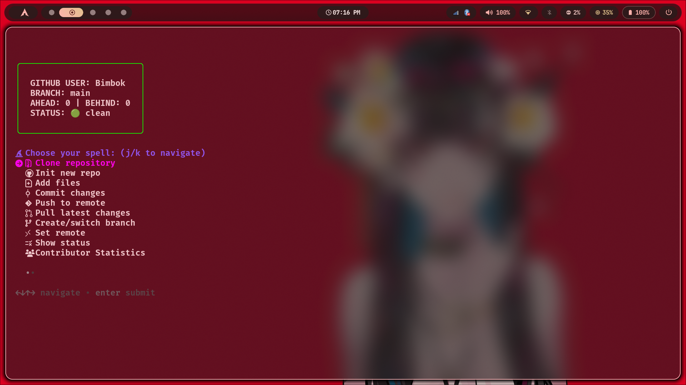
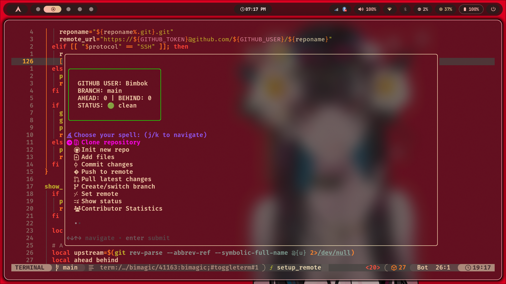

# Bimagic - Git Wizard

<p align="center">
  
</p>

<p align="center">By Bimbok and adityapaul26</p>

A powerful Bash-based Git automation tool that simplifies your GitHub workflow with an interactive menu system.

## Overview

Bimagic is an interactive command-line tool that streamlines common Git operations, making version control more accessible through a user-friendly menu interface. It handles repository initialization, committing, branching, and remote operations with GitHub integration using personal access tokens.

## Sample


<p align="center">bimagic in a terminal (kitty)</p>


<p align="center">bimagic in neovim</p>

## Features

- 🔮 Interactive menu-driven interface
- 🔐 Secure GitHub authentication via personal access tokens
- 📦 Easy repository initialization and setup
- 📥 Clone repositories (Standard or Interactive selection)
- 🔄 Simplified push/pull operations
- 🌿 Branch management made easy
- 📊 Status dashboard (ahead/behind, branch, clean/uncommitted/conflicts)
- 🛡️ Automatic master-to-main branch renaming
- 🗑️ Safe file/folder removal with git integration
- 📈 Contributor statistics with time range selection
- 🌐 Git graph (pretty git log) viewer
- 📜 The Architect (.gitignore generator)
- 🔀 Merge branches with conflict detection
- ⏪ Revert commit(s) with multi-select
- 🎨 Theme Customization (ANSI and Hex color support)
- ⏳ Time Turner (Undo last commit)
- 🗃️ Stash operations (Push, Pop, List, Apply, Drop, Clear)

## Installation

### Automated Installation (Recommended)

Run this one-line command to install Bimagic:

```bash
curl -sSL https://raw.githubusercontent.com/Bimbok/bimagic/main/install.sh | bash
```

### Quick Access (Keybinding)

The installer automatically sets up a **Ctrl + B** keybinding for **Zsh**, **Bash**, and **Fish** shells. This allows you to summon the Git Wizard from anywhere in your terminal instantly!

- **Zsh**: Uses a custom ZLE widget to ensure a clean UI transition.
- **Bash**: Uses `bind -x` for direct execution.
- **Fish**: Uses `bind \cb` with a repaint command.

*Note: You may need to restart your terminal or source your config file (e.g., `source ~/.zshrc`) after installation for the keybinding to take effect.*

### Neovim Integration

You can use Bimagic directly inside Neovim! This integration wraps the CLI tool in a floating terminal window using `toggleterm.nvim` for a seamless workflow.

#### LazyVim / Toggleterm Setup

Create a new plugin file (e.g., `~/.config/nvim/lua/plugins/bimagic.lua`) with the following configuration. This sets up a `<leader>gm` keybinding to launch the wizard in a floating popup.

```lua
return {
  {
    "akinsho/toggleterm.nvim",
    opts = function(_, opts)
      opts.size = 20
      opts.open_mapping = [[<c-\>]]
    end,
    keys = {
      {
        "<leader>gm",
        function()
          local Terminal = require("toggleterm.terminal").Terminal
          local bimagic = Terminal:new({
            cmd = "bimagic", -- This assumes 'bimagic' is in your global PATH
            hidden = true,
            direction = "float",
            float_opts = {
              border = "curved", -- 'single', 'double', 'shadow', 'curved'
              width = 100,
              height = 25,
              title = "  Bimagic Git Wizard ",
            },
            close_on_exit = true,

            on_open = function(term)
              vim.cmd("startinsert!")
              vim.api.nvim_buf_set_keymap(term.bufnr, "n", "q", "<cmd>close<CR>", { noremap = true, silent = true })
            end,
          })
          bimagic:toggle()
        end,
        desc = "Bimagic (Git Wizard)",
      },
    },
  },
}
```

### Manual Installation

1. Clone the repository:

```bash
git clone https://github.com/Bimbok/bimagic.git
```

2. Make the script executable:

```bash
chmod +x bimagic/bimagic
```

3. Move it to your bin directory:

```bash
# Option 1: For user-local installation (no sudo required)
mkdir -p ~/bin
mv bimagic/bimagic ~/bin/

# Option 2: For system-wide installation (requires sudo)
sudo mv bimagic/bimagic /usr/local/bin/
```

4. Ensure the bin directory is in your PATH (add to ~/.bashrc or ~/.zshrc if needed):

```bash
export PATH="$HOME/bin:$PATH"  # For user-local installation
```

## Dependencies

- gum (required for modern UI and interactive selection)
  - See installation instructions below or use the automated script.
  - If not installed, the tool will not work.

## Configuration

### Setting Up GitHub Credentials

Bimagic requires your GitHub username and a personal access token. Add these to your shell configuration file:

1. Open your shell configuration file:

```bash
# For bash users
nano ~/.bashrc

# For zsh users
nano ~/.zshrc
```

2. Add these lines at the end of the file:

```bash
# GitHub credentials for bimagic
export GITHUB_USER="your_github_username"
export GITHUB_TOKEN="your_github_personal_access_token"
```

3. Reload your shell configuration:

```bash
source ~/.bashrc  # or source ~/.zshrc
```

### Theme Customization 🎨

Bimagic allows you to fully customize the UI colors through a theme file.

1. **Location**: The theme file is located at `~/.config/bimagic/theme.wz`.
2. **Formats**: You can use **ANSI color numbers (0-255)** or **Hex codes (#RRGGBB)**.
3. **TrueColor Support**: Hex codes will automatically enable TrueColor mode in supported terminals.

#### Example `theme.wz`:

```bash
# Bimagic Theme Configuration

# Primary color for banners and highlights
BIMAGIC_PRIMARY="#00FFFF"

# Secondary color (Cursor, Remotes)
BIMAGIC_SECONDARY="51"

# Success, Error, and Warning colors
BIMAGIC_SUCCESS="#00FF87"
BIMAGIC_ERROR="196"
BIMAGIC_WARNING="214"

# Banner Gradients (ANSI 0-255)
BANNER_COLOR_1="51"
BANNER_COLOR_2="45"
BANNER_COLOR_3="39"
BANNER_COLOR_4="99"
BANNER_COLOR_5="135"
```

### Creating a GitHub Personal Access Token

1. Go to GitHub → Settings → Developer settings → Personal access tokens
2. Click "Generate new token"
3. Give your token a descriptive name (e.g., "bimagic-cli")
4. Select the "repo" scope (this provides full control of private repositories)
5. Click "Generate token"
6. Copy the token immediately (you won't be able to see it again!)

## Usage

Simply run the `bimagic` command in your terminal:

```bash
bimagic
```

**Pro Tip:** 
- Press **Ctrl + B** in your terminal to quickly summon the wizard from anywhere!
- You can also use the short alias **wz** (Wizard) for even faster access!

```bash
wz
```

### Command Line Flags

You can also use flags to perform specific actions immediately:

- **Clone Repository**:
  ```bash
  bimagic -d "repo-url"
  ```
- **Interactive Clone** (Select specific files/folders to download):
  ```bash
  bimagic -d -i "repo-url"
  ```
- **The Lazy Wizard** (Add + Commit + Push):
  ```bash
  bimagic -z "commit message"
  ```
- **The Crystal Ball** (Show Status Dashboard):
  ```bash
  bimagic -s
  ```
- **The Time Scroll** (Show Git Graph):
  ```bash
  bimagic -g
  ```
- **The Time Turner** (Undo last commit):
  ```bash
  bimagic -u
  ```
- **The Architect** (Summon .gitignore):
  ```bash
  bimagic -a
  ```

You'll be presented with an interactive menu where you can choose from various Git operations.

### Status Dashboard

At the top of the interface, a status box summarizes:

- Current `GITHUB_USER` and branch
- Ahead/behind counts relative to upstream (if set)
- Working tree state: clean, uncommitted, or conflicts

### Menu Options

1. **Clone repository** - Clone a repository from a URL (supports standard and interactive modes)
2. **Init new repo** - Initialize a new Git repository (auto-renames master → main)
3. **Add files** - Stage files (interactive multi-select; includes [ALL])
4. **Commit changes** - Commit staged changes with a choice between Magic Commit (Conventional Builder) or Quick Commit (One-line)
5. **Push to remote** - Push changes (handles multiple remotes and auto-configuration)
6. **Pull latest changes** - Fetch and merge changes from remote
7. **Create/switch branch** - Create a new branch or switch to an existing one
8. **Set remote** - Configure remotes (supports HTTPS with token or SSH)
9. **Show status** - Display repo status dashboard (ahead/behind, branch, cleanliness)
10. **Contributor Statistics** - View per-author activity with time range selection
11. **Git graph** - Pretty git log with graph and decorations
12. **Remove files/folders (rm)** - Safely remove files/folders with git integration
13. **Summon the Architect (.gitignore)** - Interactive .gitignore generator with 70+ blueprints
14. **Merge branches** - Merge a selected branch into the current one
15. **Uninitialize repo** – Remove Git tracking from a project
16. **Revert commit(s)** - Revert one or more commits (multi-select)
17. **Stash operations** - Manage stashes (push, pop, list, apply, drop, clear)
18. **Exit** - Quit the wizard

### Clone repository (Option 1)

This feature allows you to clone a repository with two modes:

#### Standard Clone

Perform a full `git clone` of the target repository.

#### Interactive Clone (Sparse Checkout)

If you only need specific files or folders from a large repository, this mode allows you to:

1. Download the repository metadata without file contents.
2. Select specific files/folders interactively.
3. Download only the selected items into your local directory.

Usage from CLI: `bimagic -d -i "repo-url"`

### Commit changes (Option 4)

Bimagic offers two ways to commit your staged changes:

#### 󰦥 Magic Commit (Builder)

The "Commit Spell" - a guided experience that helps you follow the [Conventional Commits](https://www.conventionalcommits.org/) specification. It prompts you for:

1. **Type**: feat, fix, docs, style, refactor, perf, test, chore.
2. **Scope**: The area of the code being changed (optional).
3. **Description**: A short, imperative-mood summary.
4. **Body**: Detailed description (optional).
5. **Breaking Changes**: Automatically adds `!` to the type/scope for visibility.

#### 󱐋 Quick Commit (One-line)

For when you just want to provide a quick message and move on.

### Contributor Statistics (Option 10)

Analyze contributions over a chosen time range (Last 7/30/90 days, Last year, All time). The tool parses `git log --numstat` to compute per-author lines changed and commit counts, and surfaces highlights like most active/productive contributors.

#### What you get:

- Per-author bar visualization and percentages
- Lines changed and commit counts
- Highlights: most active and most productive

### Git graph (Option 11)

Displays a pretty, colorized `git log --graph` with abbrev commit, decorations, author, date, and subject. Press `q` to exit the view.

### File Removal (Option 12)

The `Remove files/folders (rm)` option lets you select files and folders interactively, with full git integration:

#### Features:

- **Interactive Multi-select**: Select one or many files to remove
- **Git Integration**: Tracked files are removed via `git rm -rf`; untracked via `rm -rf`
- **Safety Confirmation**: Explicit confirmation before deletion
- **Smart Detection**: Works whether or not a file is tracked in git

#### How it works:

1. A list of tracked and untracked files is displayed
2. Use the interactive filter to multi-select entries (TAB to select, ENTER to confirm)
3. The selection is previewed and you are asked to confirm (y/N)
4. Each selected item is removed appropriately (git-tracked or filesystem)
5. A success message lists removed paths

### Summon the Architect (Option 13)

"The Architect" is a powerful `.gitignore` generator that pulls the latest industry-standard blueprints directly from GitHub's official collection.

#### Features:

- **70+ Blueprints**: Supports everything from Node, Python, and Rust to Flutter, Unity, and TeX.
- **Interactive Search**: Use `gum filter` to quickly find your language or framework.
- **Safety First**: Asks for confirmation before overwriting an existing `.gitignore` file.
- **Always Up-to-Date**: Fetches directly from the source to ensure you have the latest rules.

Usage from CLI: `bimagic -a` or `bimagic --architect`

### Merge branches (Option 14)

Merge another branch into your current branch using an interactive selector. If conflicts occur, you will be notified to resolve them manually.

#### Flow:

1. Current branch is shown
2. Select a branch (other than current) to merge into the current one
3. If merge succeeds, you get a success message; otherwise, conflicts are reported

### Revert commit(s) (Option 16)

#### Safety Features:

- **Double confirmation** for `*` (everything) - requires typing "yes"
- **Preview** of what will be deleted before proceeding
- **Existence check** - only proceeds if files actually exist
- **Git-aware** - uses `git rm` for tracked files, regular `rm` for untracked files
  Revert one or more commits selected via interactive filter from `git log --oneline`. Each selected commit is reverted in sequence; on conflicts, the process stops and you are instructed to resolve and continue.

#### Flow:

1. Select commit(s) to revert (multi-select)
2. Confirm the action (y/N)
3. Reverts run with `git revert --no-edit`
4. On conflict, resolve then run `git revert --continue`

### Time Turner (Undo)

This feature is essentially an "Undo Button" for Git. It allows you to undo the last commit with three levels of severity:

#### 1. Soft Undo

Cancels the commit but leaves your files **staged**. Best for fixing typos or adding forgotten files.

- **Scenario:** You committed "Added login" but forgot `login.css`.
- **Result:** Files are green (staged), ready to commit again.

#### 2. Mixed Undo

Cancels the commit and **unstages** the files. Best for when you want to split work into multiple commits.

- **Scenario:** You committed backend and frontend work together but want to separate them.
- **Result:** Files are red (modified), keeping your work but not staged.

#### 3. Hard Undo

**Destroys** the commit and all changes. Reverts to the previous state.

- **Scenario:** You want to trash the last commit completely.
- **Result:** Everything from that commit is gone forever. **Use with caution!**

### Stash operations (Option 16)

Manage your git stashes with a comprehensive menu.

#### Features:

- **Push (Save)**: Stash changes with an optional message and support for untracked files
- **Pop**: Apply and remove the latest stash
- **List**: View all saved stashes
- **Apply**: Apply a specific stash without removing it
- **Drop**: Delete a specific stash
- **Clear**: Remove all stashes (with safety confirmation)

## Why Sudo Might Be Required

### Understanding the Need for Elevated Privileges

The installation script may request sudo privileges for these reasons:

1. **System-wide installation**:
   - The script tries to install to `/usr/local/bin/` by default
   - This directory is typically owned by root for security reasons
   - Writing to system directories requires administrative privileges

2. **Directory permissions**:
   - If you don't have a `~/bin` directory or it's not writable
   - The script falls back to system installation

### Avoiding Sudo Requirements

You can avoid needing sudo by:

1. Creating a local bin directory:

   ```bash
   mkdir -p ~/bin
   ```

2. Ensuring it's in your PATH (add to ~/.bashrc or ~/.zshrc):

   ```bash
   export PATH="$HOME/bin:$PATH"
   ```

3. Running the installation again

## Security Considerations

1. **Token Security**:
   - Your GitHub token is stored in your shell configuration file
   - Protect this file with proper permissions (chmod 600)
   - Never share your token or commit it to version control

2. **Script Integrity**:
   - Review the installation script before running it
   - The script only copies files and sets permissions

3. **Network Security**:
   - The script uses HTTPS to communicate with GitHub
   - Ensure you're on a secure network when using the tool

## Troubleshooting

### Common Issues

1. **"Command not found" after installation**
   - Your bin directory may not be in PATH
   - Add `export PATH="$HOME/bin:$PATH"` to your shell config file
   - Run `source ~/.bashrc` or `source ~/.zshrc`

2. **Permission denied errors**
   - The script might not be executable
   - Run `chmod +x ~/bin/bimagic` or `sudo chmod +x /usr/local/bin/bimagic`

3. **GitHub authentication errors**
   - Verify your GITHUB_USER and GITHUB_TOKEN environment variables are set correctly
   - Ensure your token has the necessary permissions

4. **Remote operation failures**
   - Check your internet connection
   - Verify the repository name is correct

### Getting Help

If you encounter issues:

1. Check that Git is installed: `git --version`
2. Verify your environment variables are set: `echo $GITHUB_USER`
3. Ensure you have a GitHub personal access token with repo permissions

## Uninstallation

If you ever need to remove Bimagic from your system, you have two options:

### Option 1: Curl Directly (Recommended)

Run the uninstall script directly from GitHub:

```bash
curl -sSL https://raw.githubusercontent.com/Bimbok/bimagic/main/uninstall.sh | bash
```

### Option 2: Manual Uninstallation

1. Remove the Bimagic script:

   ```bash
   # Remove from user directory (if installed there)
   rm -f ~/bin/bimagic

   # Remove from system directory (if installed there - requires sudo)
   sudo rm -f /usr/local/bin/bimagic
   ```

2. Optional: Remove GitHub credentials from your shell configuration:

   ````bash
   # Edit your shell config file (e.g., ~/.bashrc, ~/.zshrc)
   # Remove lines containing GITHUB_USER and GITHUB_TOKEN
   nano ~/.bashrc  # or ~/.zshrc
   ```### What the Uninstall Script Does

1. **Finds Installations**: Checks common installation directories (~/bin and /usr/local/bin)
2. **Confirmation**: Asks for confirmation before proceeding
3. **Removes Bimagic**: Deletes the script and `wz` alias from all found locations
4. **Cleans Shell Config**: Offers to remove **GITHUB_USER**, **GITHUB_TOKEN**, and the **Ctrl + B** shell integrations from your config files
5. **Creates Backups**: Creates timestamped backups of modified shell configuration files

### Safety Features

- Asks for confirmation before removing anything
- Creates backups of modified configuration files
- Uses sudo only when necessary (for system directories)
- Provides clear feedback about what's happening
- Includes timestamped backups to prevent data loss

### Notes

- The uninstall script will only remove the Bimagic script file
- Your Git repositories and other files will not be affected
- GitHub credentials are only removed if you explicitly choose to do so
- Backups are created before modifying any configuration files

Remember to update your repository with both the `uninstall.sh` script and the updated README section.

## Contributing

Contributions to Bimagic are welcome! Please feel free to submit pull requests or open issues for bugs and feature requests.

## License

This project is open source and available under the MIT License.

## Disclaimer

This tool is provided as-is without any warranties. Use it at your own risk. Always ensure you have backups of important repositories before performing operations with this tool.

---

**Enjoy the magical Git experience!** ✨
